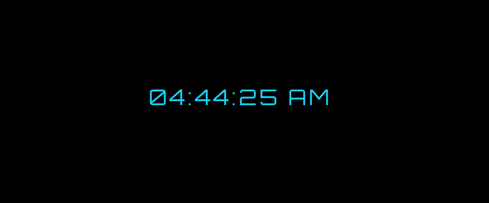

# Digital Clock Project 

A clean and modern digital clock built with HTML, CSS, and JavaScript that displays real-time hours, minutes, and seconds.

## 🚀 Features

- **Real-time Display**: Shows current time with automatic updates every second
- **Clean Design**: Modern, minimalist interface
- **12-Hour Format**: Displays time in standard 12-hour format with AM/PM
- **Clean Design**: Modern, minimalist interface with cyan blue text on black background
- **Centered Layout**: Clock is perfectly centered on the page
- **Custom Styling**: Uses Orbitron font with elegant letter spacing

## 🛠️ Technologies Used

- **HTML5**: Structure and markup
- **CSS3**: Styling and responsive design
- **JavaScript**: Real-time functionality and DOM manipulation

## 📸 Preview




## 🎯 Live Demo

[View Live Demo](https://john-keppe.github.io/Digital-Clock-Project/)

## 📥 Installation & Setup

1. **Clone the repository**
   ```bash
   git clone https://github.com/yourusername/Digital-Clock-Project.git
   ```

2. **Navigate to the project directory**
   ```bash
   cd Digital-Clock-Project
   ```

3. **Open the project**
   - Simply open `index.html` in your web browser
   - Or use a local server for development:
     ```bash
     # Using Python
     python -m http.server 8000
     
     # Using Node.js
     npx serve
     ```

## 📁 Project Structure

```
Digital-Clock-Project/
├── index.html          # Main HTML file
├── styles.css          # CSS styles
├── script.js           # JavaScript functionality
├── README.md           # Project documentation
└── screenshot.png      # Preview image (optional)
```

## 🎨 Customization

You can easily customize the clock by modifying:

- **Colors**: Update the CSS variables in `styles.css`
- **Font**: Change the font family in the CSS
- **Time Format**: Modify the JavaScript to switch between 12/24 hour format
- **Animations**: Adjust transition effects and animations

## 🤝 Contributing

Contributions are welcome! If you have suggestions for improvements:

1. Fork the repository
2. Create a feature branch (`git checkout -b feature/improvement`)
3. Commit your changes (`git commit -m 'Add some improvement'`)
4. Push to the branch (`git push origin feature/improvement`)
5. Open a Pull Request

## 📄 License

This project is open source and available under the [MIT License](LICENSE).

## 🙏 Acknowledgments

- Tutorial followed: [Step-by-Step Guide: Create a Digital Clock with HTML, CSS, and JavaScript](https://www.codewithfaraz.com/content/171/step-by-step-guide-create-a-digital-clock-with-html-css-and-javascript#introduction)
- Special thanks to Claude (Anthropic's AI assistant) for helping debug HTML/CSS syntax errors and guiding me through the GitHub Pages deployment process for my first project

## 📧 Contact   

Your Name - [john.keppe@zohomail.com](mailto:john.keppe@zohomail.com)

Project Link: [https://github.com/yourusername/Digital-Clock-Project](https://github.com/john.keppe/Digital-Clock-Project)

---

⭐ If you found this project helpful, please give it a star!
